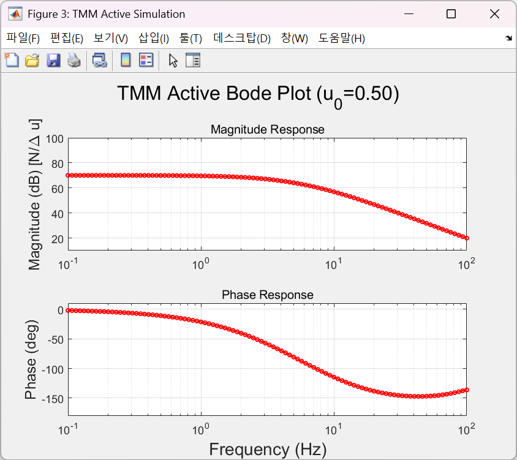
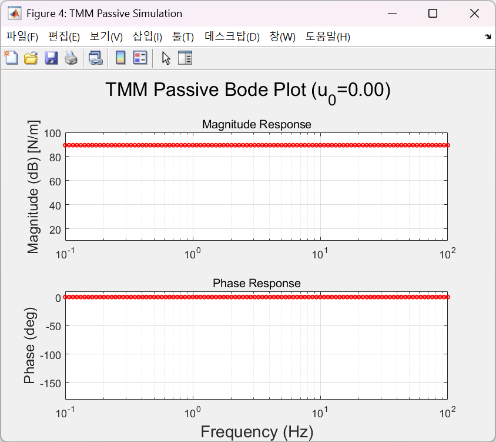
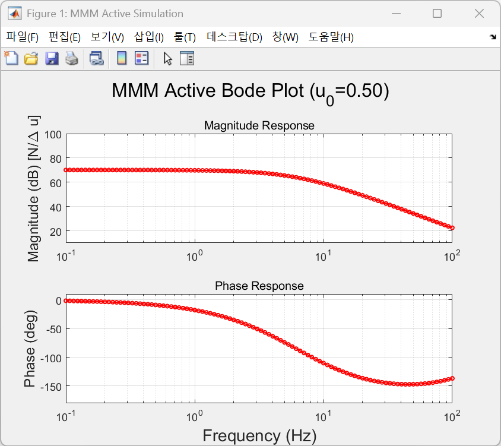
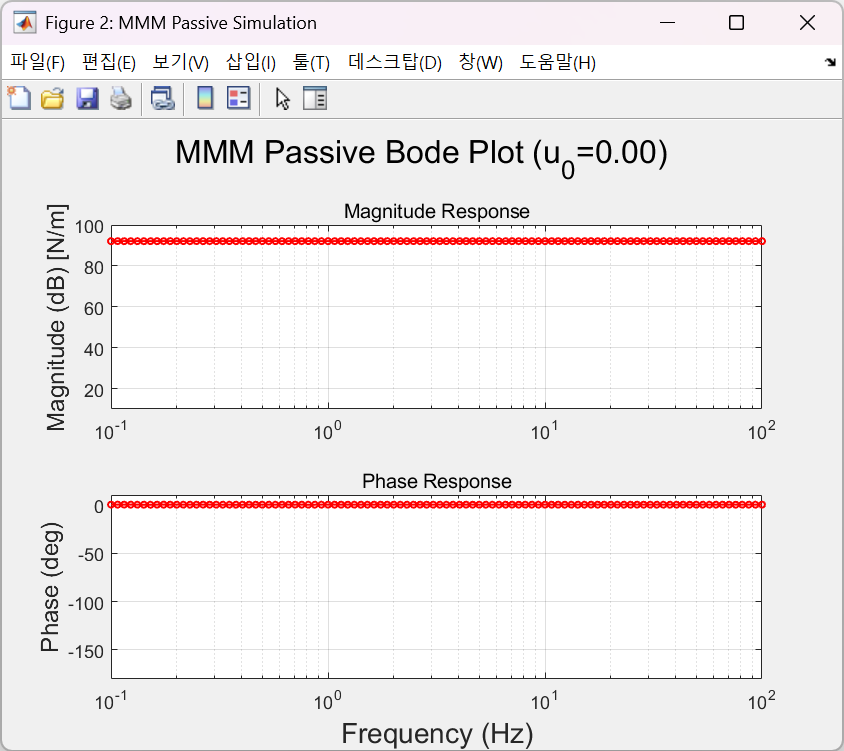

# C++ Implementation: Muscle Frequency Response (Individual)

This sub-project provides the C++ implementation for analyzing the frequency response of muscle models using the **OpenSim-Core** library. It is designed to perform both active and passive tests for Thelen (2003) and Millard (2012) models.

---

## 🛠 Prerequisites

To build and run this project, ensure you have the following installed:

* **OpenSim-Core (4.x or higher)**: Must be compiled and installed on your system. ([Installation Guide](https://github.com/opensim-org/opensim-core))
* **CMake (3.20 or higher)**: For build configuration.
* **Compiler**: 
    * Windows: Visual Studio 2022 (C++17 support required).
    * Linux/macOS: GCC 9+ or Clang.
* **MATLAB**: For post-processing and generating Bode plots.

---

## ⚙️ How to Build & Run

### 1. Build the Project
1.  **Open a Terminal** (or Native Tools Command Prompt for VS).
2.  **Navigate to this directory**:
    ```bash
    cd CPP_Version_Individual
    ```
3.  **Configure and Build with CMake**:
    Replace `[PATH_TO_OPENSIM]` with the directory containing `OpenSimConfig.cmake`.
    ```bash
    mkdir build
    cd build
    cmake .. -DOpenSim_DIR="[PATH_TO_OPENSIM]"
    cmake --build . --config Release
    ```

### 2. Run the Simulation
Execute the generated **`SimRunner`** to perform muscle tests.
* **Windows**: `.\Release\SimRunner.exe`
* **Linux/macOS**: `./SimRunner`

This will generate raw simulation data (e.g., time, length, and force) required for frequency analysis.

---

## 📊 Post-Processing: Frequency Analysis

Once the simulation data is generated by `SimRunner`, use the provided MATLAB script to analyze the results.


### **How to generate Bode Plots**
1. Open **MATLAB** and navigate to the `CPP_Version_Individual` directory.
2. Run the following script:
   ```matlab
   run('run_frequency_analysis.m')
   ```
3. What it does:
* Reads the raw output data generated by the C++ simulation.
* Calculates the frequency response (Magnitude and Phase).
* Generates Bode Plots to visualize the dynamic characteristics of the muscle models.

---

## 📁 Source Files Description
* SimRunner Components:
  * main.cpp: Entry point for simulation.
  * TMM_active.cpp / TMM_passive.cpp: Testing routines for Thelen model.
  * MMM_active.cpp / MMM_passive.cpp: Testing routines for Millard model.

* Analysis Tool:
  * run_frequency_analysis.m: MATLAB script for FFT-based frequency response calculation and plotting.

## Result Images

### Thelen Muscle Model Active Test
#### >> TMM_active


### Thelen Muscle Model Passive Test
#### >> TMM_passive

Once the simulation data is generated by `SimRunner`, use the provided MATLAB script to analyze the results.

### Millard Muscle Model Active Test
#### >> MMM_active


### Millard Muscle Model Passive Test
#### >> MMM_passive
