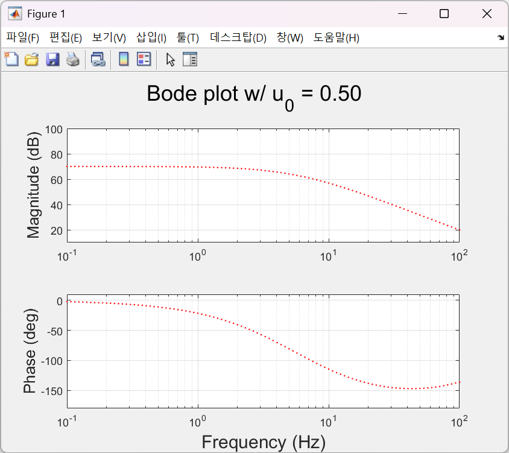
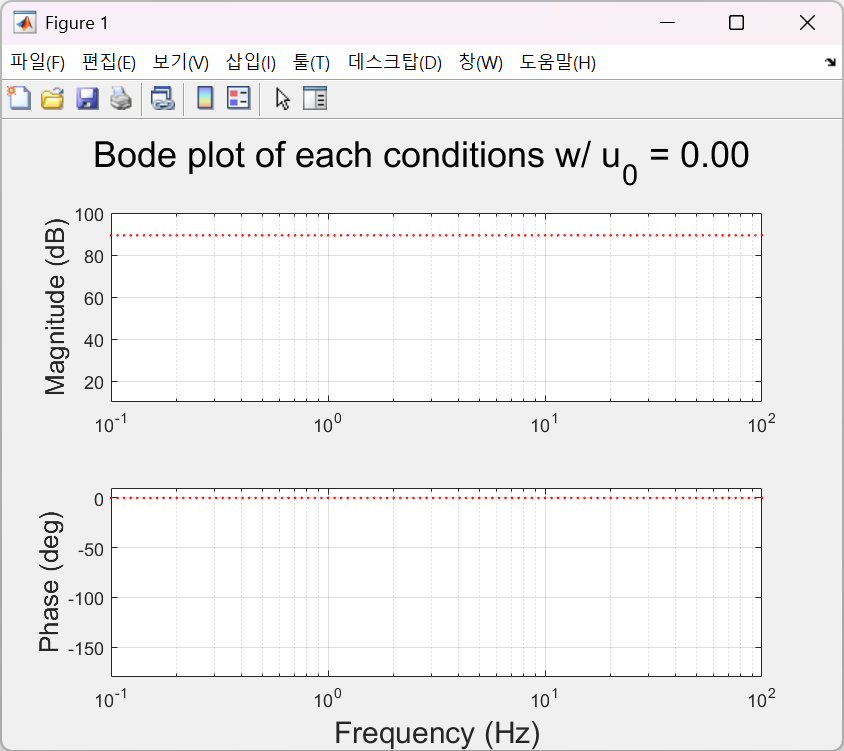
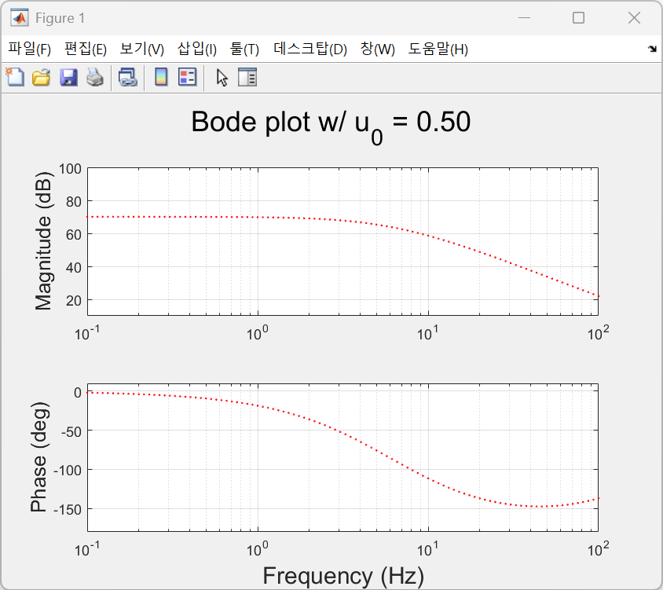
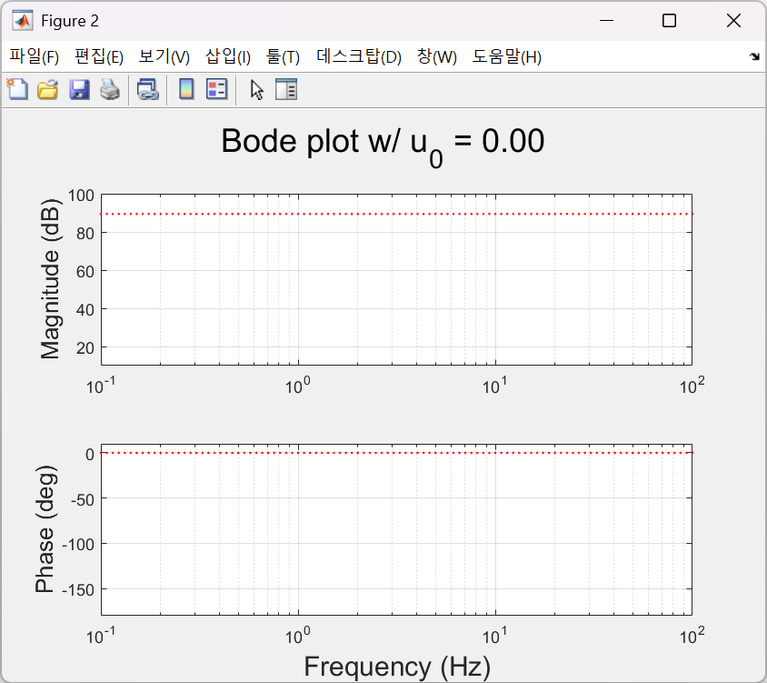

# MuscleFreqResp (MFR)

This repository contains MATLAB implementations of two numerical Hill-type muscle models and scripts for frequency response analysis as described in our submitted manuscript.

The repository includes:
- MATLAB code, tested on **Windows 11** using **MATLAB R2025b**
- Implementations of the Thelen (2003) and Millard (2012) muscle models
- Scripts for generating Bode plots for both active and passive state analyses

---

# Installation & Usage

### 1. Prerequisite (Crucial Step)
To use the Millard Muscle Model, you must include the original implementation code.

1. Create a folder named **`MMM`** in the root directory of this repository.
2. Download the code from the official [Millard2012EquilibriumMuscleMatlabPort](https://github.com/mjhmilla/Millard2012EquilibriumMuscleMatlabPort) repository.
3. Place all the downloaded files into the `MMM` folder.
* It is already included in this repository for your convenience.

> **Note:** Without the `MMM` folder and its contents, the Millard model scripts will not function.

### 2. Running the Scripts
Simply download this repository and run the .m files in MATLAB. No complex installation is required.

- Open MATLAB and navigate to the repository folder.
- Run the desired script directly from the Command Window (e.g., `TMM_active`).

---

# Muscle Models

## 1. Thelen Muscle Model (TMM)
MATLAB implementation based on:

> Thelen, D. G. (2003). *Adjustment of muscle mechanics model parameters to simulate dynamic contractions in older adults.* Journal of Biomechanical Engineering, 125(1), 70–77.

**Implementation Notes**
- The governing equations described in the paper were implemented directly in MATLAB.
- To ensure correctness, core curve functions (F–L, F–V, passive elements, activation dynamics) were reproduced from the original formulation.

## 2. Millard Muscle Model (MMM)
The Millard model is implemented using the official [MATLAB port](https://github.com/mjhmilla/Millard2012EquilibriumMuscleMatlabPort) distributed by the original author.

Reference:
> Millard, M., Uchida, T., Seth, A., & Delp, S. L. (2013). Flexing computational muscle: modeling and simulation of musculotendon dynamics. *Journal of Biomechanical Engineering*, 135(2), 021005.

**Implementation Notes**
- This project provides options to choose three variants of the Millard model in the beginning of code:
  - `Classic` (classic model)
  - `DEq` (damped-equilibrium version)
  - `Rigid` (rigid-tendon condition)

---

# Result Images

## Thelen Muscle Model Active Test
#### >> TMM_active

## Thelen Muscle Model Passive Test
#### >> TMM_passive

## Millard Muscle Model Active Test
#### >> MMM_active

## Millard Muscle Model Passive Test
#### >> MMM_passive

---

# Other Information

## Author
- **Minseung Kim**, Ph.D. Student (KAIST)
- **Seungwoo Yoon**, Ph.D. (KAIST)
- **Seungbum Koo**, Ph.D. (KAIST)

## Revision Notes
- **August 2025**: Initial implementation
- **August 2025**: README and main script update
- **November 2025**: Debugged runtime errors
- **January 2026**: Minor bug fix and refactoring