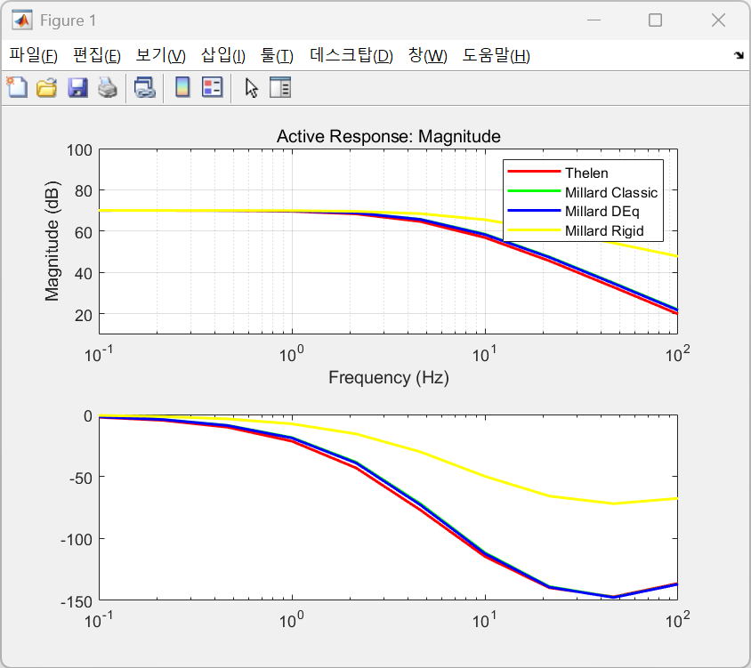
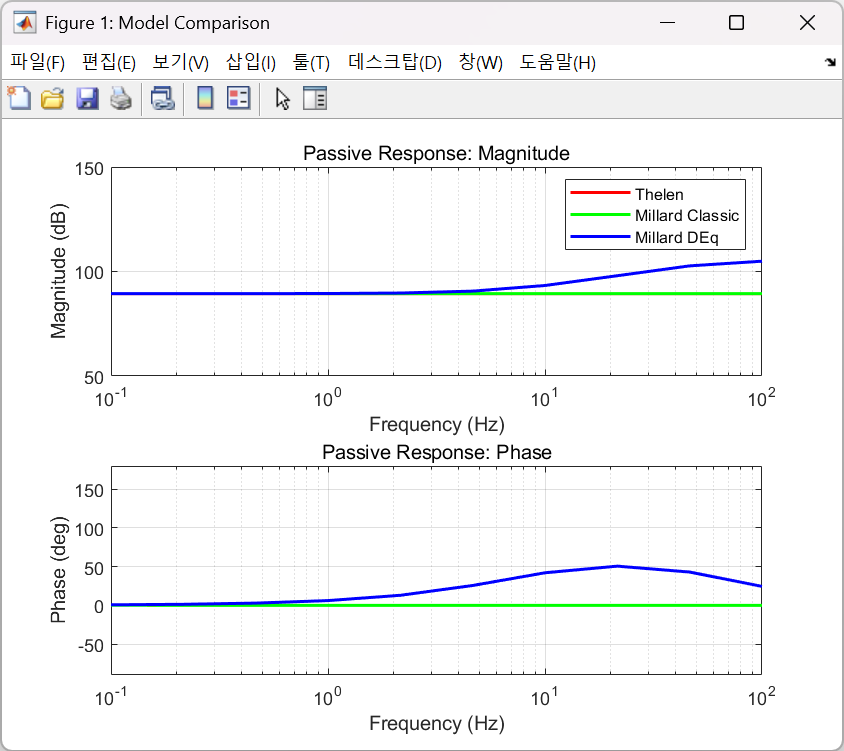

# MATLAB Implementation: Structured Muscle Frequency Response

This directory contains a **refactored, object-oriented (OOP) implementation** of the muscle frequency response analysis. Unlike the individual scripts, this version uses class-based muscle models for better modularity, making it easier to compare different models and integrate new ones.

---

## 🏗 Project Architecture

This version is organized to separate the muscle dynamics (Models) from the simulation logic (Tests).

### 1. Muscle Model Classes (OOP)
* `MuscleModel.m`: The base class (Abstract) defining the common interface for all muscle models.
* `ThelenMuscle.m`: Class implementation of the **Thelen (2003)** muscle model.
* `MillardMuscle.m`: Class implementation of the **Millard (2012)** muscle model, interfacing with the core MMM functions.

### 2. Simulation & Analysis Scripts
* `main.m`: The main entry point. It orchestrates the entire process from model initialization to final plotting.
* `run_active_test.m`: A modular function dedicated to performing frequency sweeps in the active state.
* `run_passive_test.m`: A modular function dedicated to performing frequency sweeps in the passive state.

---

## 🚀 How to Use

1. **Open MATLAB** and navigate to this directory (`Matlab_Version_Structured`).
2. **Setup Dependencies**: 
   Ensure the `MMM` folder (containing the official Millard model) is present in the root directory and added to your MATLAB path.
3. **Run the Analysis**:
   Simply execute the `main.m` script:
   ```matlab
   run('main.m')
   ```
4. Results:
   The script will automatically:
* Instantiate both Thelen and Millard muscle objects.
* Run active and passive frequency response simulations.
* Generate comprehensive Bode plots comparing the models.

--- 

## 💎 Why use the Structured Version?
* Scalability: Want to test a new muscle model? Just create a new class inheriting from `MuscleModel.m`.
* Consistency: Ensuring that both TMM and MMM are tested under identical simulation conditions (frequency range, time steps, etc.) defined in the test scripts.
* Automation: A single click in main.m handles the entire pipeline—from simulation to professional visualization.

---

## Sample Result Images

### Active Tests on Thelen (2003) and Millard (2012)


### Passive Tests on Thelen (2003) and Millard (2012)

