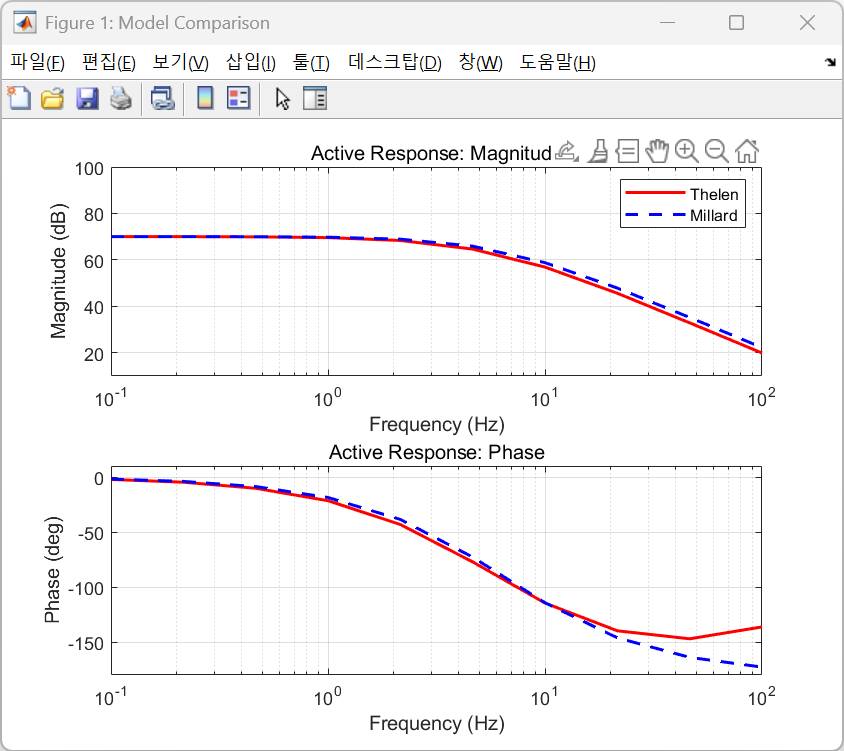
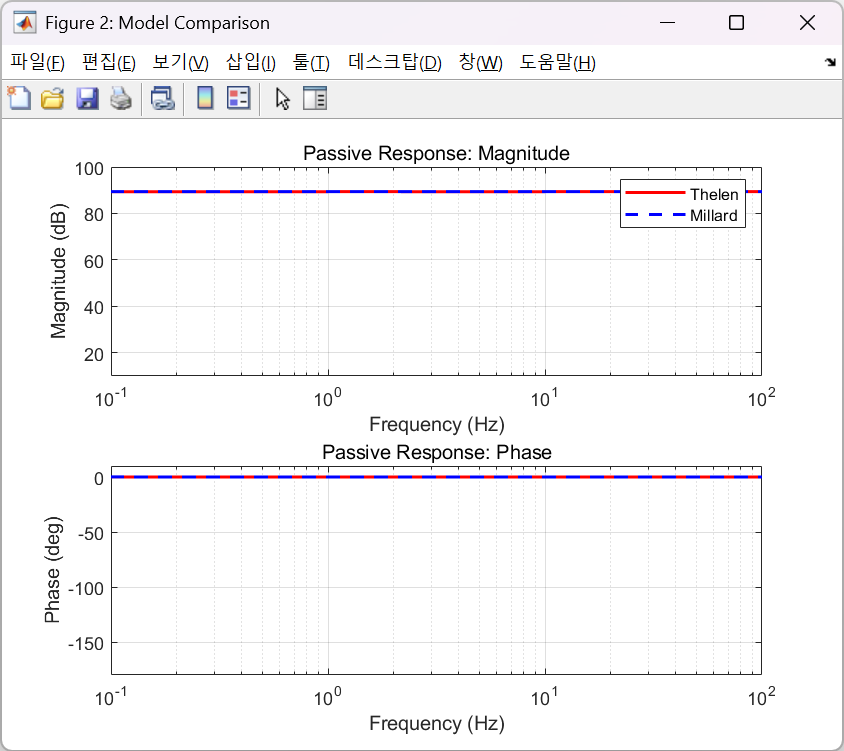

# MuscleFreqResp (MFR)

**MuscleFreqResp** provides a comprehensive framework for analyzing the frequency response of Hill-type muscle models. This tool compares the dynamic characteristics of **Thelen (2003)** and **Millard (2012)** models in both active and passive states as presented in our manuscript (link will be provided upon publication).

---

## 🚀 Key Features
* **Dual-Language Implementation:** Identical frequency response tests in both C++ (OpenSim-based) and MATLAB.
* **Comparative Analysis:** Tools to generate Bode plots for active/passive muscle dynamics.
* **Thelen (2003) Core:** Independent MATLAB implementation of the Thelen model's governing equations.

## 📁 Repository Structure
* `CPP_Version_Individual`: C++ source code requiring OpenSim-Core.
* `Matlab_Version_Individual`: MATLAB scripts for individual tests.
* `Matlab_Version_Structured`: Organized MATLAB scripts for systematic testing.
* `MMM`: Ported Millard (2012) muscle model files.
* `images`: Visualization of frequency response results.

---

## 🔧 Installation & Usage

Detailed instructions for building and running the code are provided within each sub-project directory. Please click the links below to view the specific guide for each version:

* [C++ Version Individual](./CPP_Version_Individual) - Requires OpenSim-Core and CMake
* [MATLAB Individual Version](./Matlab_Version_Individual) - Standalone scripts
* [MATLAB Structured Version](./Matlab_Version_Structured) - Systematic analysis and batch processing

# Muscle Models

## 1. Thelen Muscle Model (TMM)
MATLAB implementation based on:

> Thelen, D. G. (2003). *Adjustment of muscle mechanics model parameters to simulate dynamic contractions in older adults.* Journal of Biomechanical Engineering, 125(1), 70–77.

**Implementation Notes**
- The governing equations described in the paper were implemented directly in MATLAB.
- To ensure correctness, core curve functions (F–L, F–V, passive elements, activation dynamics) were reproduced from the original formulation.

## 2. Millard Muscle Model (MMM)
The Millard model is implemented using the official [MATLAB port](https://github.com/mjhmilla/Millard2012EquilibriumMuscleMatlabPort) distributed by the original author.

Reference:
> Millard, M., Uchida, T., Seth, A., & Delp, S. L. (2013). Flexing computational muscle: modeling and simulation of musculotendon dynamics. *Journal of Biomechanical Engineering*, 135(2), 021005.

---

# Sample Result Images

## Active Tests on Thelen (2003) and Millard (2012)

## Passive Tests on Thelen (2003) and Millard (2012)

---

# Other Information

## Author
- **Minseung Kim**, Ph.D. Student (KAIST)
- **Seungwoo Yoon**, Ph.D. (KAIST)
- **Seungbum Koo**, Ph.D. (KAIST)

## Revision Notes
- **August 2025**: Initial implementation
- **August 2025**: README and main script update
- **November 2025**: Debugged runtime errors
- **January 2026**: Minor bug fix and refactoring
- **February 2026**: C++ implementation of tests using OpenSim functions